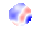

# Wavefronts

## Theory

Generally speaking, term wavefront refers a surface in space where the phase of the wave is constant.

If a laser pulse was perfect, then the wavefront of each pulse corresponding to (for example) the peak intensity of a pulse would be a flat plane perpendicular to the direction of the laser. A target surface would therefore experience the peak intensity at every point at the same time.

In reality, the optical components of a laser will not be perfect, and these imperfections will cause parts of the pulse to be delayed relative to each other. For example, the peak intensity at the centre of the beam might arrive at a target before the edges of the beam peak in intensity. This can either be thought of as a separation in distance (along direction of travel) at a specific point in time, or as a separation in arrival time across a specific plane as phase is a combination of distance and time.

## In OperationsGateway

To represent this concept, two new channel data types were required. In general any appropriate data could be stored in these data structures, but at the time of writing the only anticipated use case for each is for wavefronts, as described below.

In the channel manifest, `vector` channels have the same name as the corresponding `float_image` channel with `-COEF` appended to the end.

### `float_image`

Also known as "nullable image" in some earlier documentation/communication. Once the EPAC data sim was updated to generate these, it used the term `float_image` so that has been adopted as the official term.

#### Technical summary

Represents a 2D array of floating point numbers. Supports not a number (NaN) values.

Has metadata to support pixel size and units, but not any other `image` metadata (`gain`, `exposure_time_s`, `bit_depth`).

#### Use for wavefronts

Rather than each pixel representing intensity of light at that point in space at a specific time (as the regular images do) each pixel value represents how much that point lags or leads the rest of the beam. This means the value can be positive or negative, and there is no well defined maximum value we can expect. Values are only defined where the beam is defined, so typically we expect defined values in a central circle with NaNs around it. Dimensions are also a lot smaller than traditional images. When representing this to the user, the main considerations are how to represent NaNs and apply false colour.

Like traditional images, the frontend will expect a PNG for a `float_image`, which means we can only represent data using integer pixel values. Alongside the L (greyscale) and RGB colour modes, LA and RGBA provide an additional alpha channel. Visually this defines the transparency of the pixel. We can therefore set alpha to 0 (transparent) for NaNs and 255 (opaque) for all finite numbers. Not only is this colourmap independent, but it can also be used for the thumbnails in Mongo, which are stored as LA. If we want the thumbnails in a different colourmap, the L channel can be mapped to RGB and the A channel re-applied.

Since they do not represent brightness/intensity of light at a detector, the "true colour" of float_images is not a meaningful concept. They need to always be mapped to false colour. Since the values will be relative to 0, it makes sense to use "diverging" colourmaps so that positive, negative and 0 values are distinct. For each image, the maximum absolute value is used to scale the colourmap. For example, if values range from -10 to +5 or -5 to +10, in both cases we would scale the colour map from -10 to +10 so that 0 values remain at the midpoint when using a diverging colour map.

In Echo, and for export, we store the data as a compressed numpy array (`.npz`). Any analysis a user performs will likely start by loading with Python, so a compatible format saves the user having to manually extract the data from a dedicated image format like `.tiff`. By storing in this format, we do not have to convert for export, whilst also maintaining a small filesize in Echo. There is no greyscale "original image" like the regular `image` case that might be returned directly; we would always have to convert from a storage to display format so nothing is lost from not storing it as an image format.

### `vector`

#### Technical summary

Represents a 1D array of floating point numbers.

Has metadata to support `units` and `labels`, which is an array of strings with the same length as the data itself.

#### Use for wavefronts

While the `float_image` channel gives a visual indication of the phase difference, a mathematical description is also useful. For this, the [Zernike polynomials](https://en.wikipedia.org/wiki/Zernike_polynomials) are used. Each polynomial describes a symmetrical difference in value across a circle. For example, values that are greater at the top than the bottom ("tilt y"), the right than the left ("tilt x"), or the edge than the centre ("defocus"). Higher order polynomials describe increasingly complex imperfections.

Any real signal observed can be expressed as a linear combination of these polynomials. A seemingly random phase wavefront can be broken down into a positive or negative contribution from each polynomial, with differing magnitudes. The co-efficient for each polynomial in this overall sum is a separate entry in the vector. For example, a signal might have a large positive contribution for the "tilt x" combined with a small negative contribution for "tilt y" (if it was the greater at the bottom rather than the top).

The polynomials form an infinite sequence, however in practice the lowest order (simplest) polynomials will have the largest co-efficients (greatest contributions). As a result, the vectors will probably have 20 entries.

Sometimes more Zernike polynomials will be calculated. A user might also want to exclude higher order terms when comparing across different channels/records. To facilitate this, a user preference for skipping and limiting the vector is implemented. The results could be limited to the first 5, or skip the first 2. These preferences will be applied to all thumbnails returned by the records endpoint.

For the `labels` metadata, the strings give either a description of the polynomial in real terms or (for the higher order polynomials) the index notation that identifies it:

- Tilt X
- Tilt Y
- Defocus
- Astigmatism
- Oblique astigmatism
- Coma Y
- Coma X
- Trefoil
- Oblique trefoil
- Spherical
- Z_4^2
- Z_4^-2
- Z_4^4
- Z_4^-4
- Z_5^1
- Z_5^-1
- Z_5^3
- Z_5^-3
- Z_5^5
- Z_5^-5
